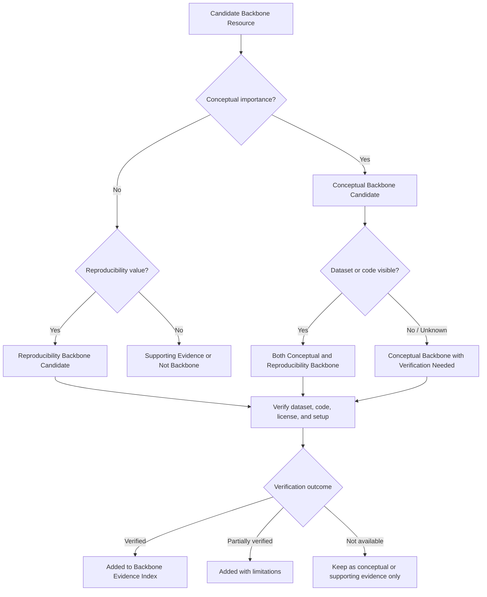

# Backbone Evidence Layer

The **Backbone Evidence Layer** identifies the most important papers, datasets, code resources, and benchmark materials supporting the **AI/ML WiFi Sensing Hub**.

This layer separates evidence into two complementary categories:

1. **Conceptual Backbone** — papers that justify the research problem, threat model, security gap, clinical-safety framing, or defense theory.
2. **Reproducibility Backbone** — papers, datasets, code repositories, and benchmark resources that support experimental verification, reproducibility, or claim checking.

This separation is important because a paper may be conceptually central even if its dataset or code is not publicly available, while a dataset or code repository may be experimentally valuable even if it is not the main conceptual motivation.

---

## Why This Layer Matters

A professional evidence hub should distinguish between two different kinds of importance:

| Evidence Type | Main Question | Example Value |
|---|---|---|
| Conceptual importance | Does this work justify the research problem or technical direction? | Threat model, attack mechanism, clinical-safety gap, defense theory |
| Reproducibility value | Can the dataset, code, or benchmark claim be checked? | Public dataset, GitHub repository, benchmark library, reproducible baseline |

This structure helps avoid treating all papers equally. Some papers are essential because they define the problem; others are essential because they make experiments possible.

---

## A. Conceptual Backbone Papers

These papers justify the thesis idea and research direction.

| Resource | Role in the Hub | Current Verification Status |
|---|---|---|
| Li et al. | Physical-layer WiFi sensing attack through preamble/LTF perturbation | Needs verification |
| Ambalkar et al. | Adversarial attack and defense for WiFi-based apnea detection | Needs verification |
| Huang et al. | OFDM subcarrier-level CSI manipulation | Needs verification |
| Cao et al. | WiIntruder / black-box perturbation attacks on WiFi sensing | Needs verification |
| Cohen et al. | Randomized smoothing and certified robustness theory | Theory backbone |

---

## B. Reproducibility Backbone Papers and Resources

These resources support actual experiments, benchmark design, dataset/code verification, or claim checking.

| Resource | Role in the Hub | Current Verification Status |
|---|---|---|
| SenseFi | Open-source WiFi CSI sensing benchmark/library | Needs review |
| CSI-Bench | Large-scale in-the-wild WiFi sensing benchmark | Needs review |
| WiAR | Public WiFi activity-recognition dataset | Needs review |
| FallDeFi / Nakamura et al. | Fall-detection experiment resource with potential reproducibility value | Needs verification |
| Chu et al. | Deep-learning WiFi CSI fall-detection paper; dataset/code access should be verified | Needs verification |
| DeepVS / HR-RR datasets | Candidate vital-sign resources; include only after dataset/code verification | Needs verification |

---

## Evaluation Logic

Each backbone item should be evaluated using two independent questions:

| Question | Meaning |
|---|---|
| Does it justify the research problem? | Conceptual importance |
| Can its data, code, or benchmark claims be checked? | Reproducibility value |

A resource can be:

- Conceptually central but not reproducible
- Reproducible but only supporting evidence
- Both conceptually central and reproducible
- Not currently suitable as backbone evidence

---

## Backbone Categories

| Category | Meaning |
|---|---|
| Conceptual Backbone | Core paper supporting the research idea, threat model, security gap, clinical-safety framing, or defense theory |
| Reproducibility Backbone | Dataset, benchmark, code repository, or paper that supports verification and experimental reuse |
| Both | Resource that is both conceptually central and reproducible |
| Supporting Evidence | Useful background or supporting paper, but not a primary backbone item |
| Not Backbone | Relevant but not central enough for the backbone layer |

---

## Verification Criteria

Each backbone item should be reviewed for:

| Criterion | Question |
|---|---|
| Dataset visibility | Is the dataset public, request-only, unavailable, or unknown? |
| Code visibility | Is the code public, partial, unavailable, or unknown? |
| Reproducibility status | Can the result be independently checked or reproduced? |
| Hardware requirements | Does the work require Intel 5300, SDR, commodity APs, specialized devices, or unknown hardware? |
| Setup clarity | Are preprocessing, model, environment, and evaluation steps described clearly? |
| Security relevance | Does the work directly support adversarial, privacy, robustness, or physical-layer risk analysis? |
| Application category | Does it support healthcare-relevant sensing, human activity recognition, smart environments, or another category? |
| Evidence strength | Is it core evidence, supporting evidence, background evidence, or not reviewed? |

---

## Suggested Tracking Fields

Backbone resources should be tracked using the following fields in the GitHub Project and CSV evidence maps:

| Field | Example Values |
|---|---|
| Backbone Category | Conceptual Backbone, Reproducibility Backbone, Both, Supporting Evidence, Not Backbone |
| Backbone Role | Physical-layer attack model, apnea attack/defense case, benchmark library, public dataset |
| Dataset Visibility | Public, Request Needed, Needs Verification, Unavailable, Unknown, Not Applicable |
| Code Visibility | Public, Partial, Needs Verification, Unavailable, Unknown, Not Applicable |
| Verification Status | Verified, Needs Verification, Partially Verified, Not Available, Unknown |
| Reproducibility Level | High, Medium, Low, Not Reviewed, Not Applicable, Unknown |
| Security Relevance | Direct, Partial, Background, Not Security-Relevant, Unknown |
| Evidence Strength | Core Evidence, Supporting Evidence, Background Evidence, Weak / Unclear, Not Reviewed |
| Priority | High, Medium, Low, Later |

---

## Initial Backbone List

The initial backbone list contains two groups.

### Conceptual Backbone

- Li et al. — physical-layer WiFi sensing attack
- Ambalkar et al. — WiFi apnea attack and defense
- Huang et al. — OFDM subcarrier-level CSI manipulation
- Cao et al. — WiIntruder black-box perturbation attack
- Cohen et al. — randomized smoothing certified robustness

### Reproducibility Backbone

- SenseFi — WiFi CSI sensing benchmark/library
- CSI-Bench — large-scale WiFi sensing benchmark
- WiAR — public WiFi activity-recognition dataset
- FallDeFi / Nakamura et al. — WiFi CSI fall-detection resource
- Chu et al. — deep-learning WiFi CSI fall detection
- DeepVS / HR-RR dataset candidate

---

## Review Workflow

---

## Current Status

This folder organizes the first high-value evidence layer for the **AI/ML WiFi Sensing Hub**.

Backbone evidence should be updated as papers, datasets, code repositories, and benchmarks are verified.
