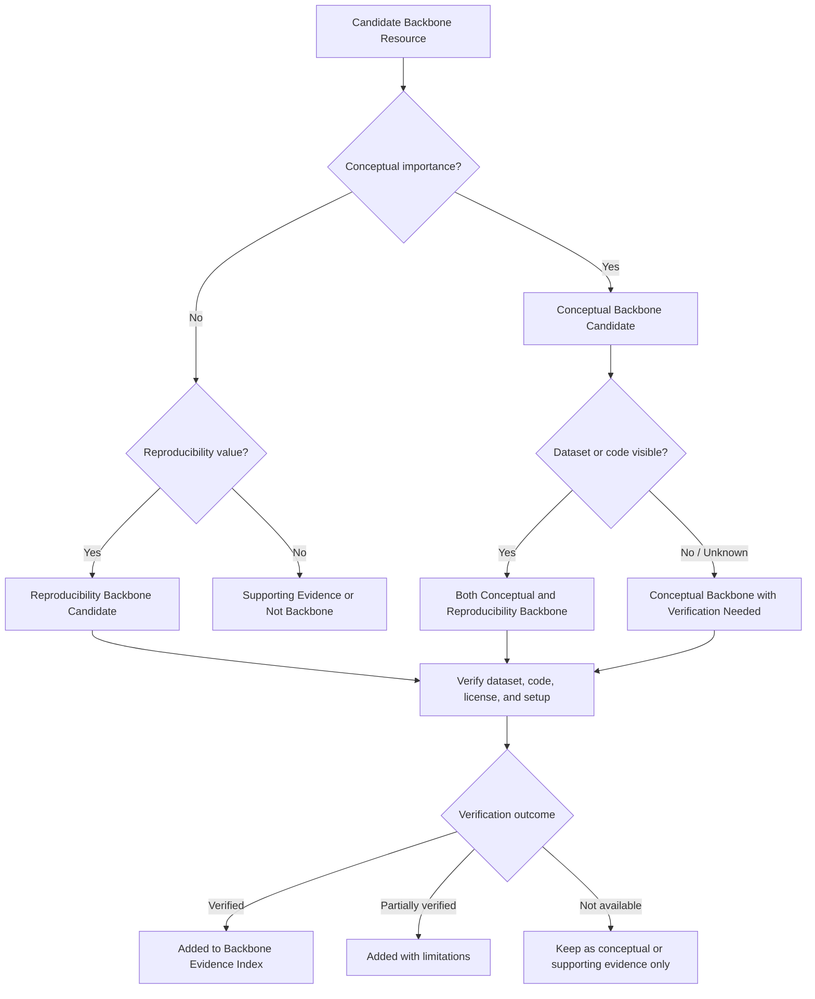

# Backbone Evidence Layer

The **Backbone Evidence Layer** identifies the highest-value papers, datasets, code resources, and benchmark materials supporting the **AI/ML WiFi Sensing Hub**.

This layer separates evidence into two complementary categories:

1. **Conceptual Backbone** — papers that justify the research problem, threat model, security gap, clinical-safety framing, or defense theory.
2. **Reproducibility Backbone** — datasets, code repositories, benchmark papers, and experimental resources that support verification, reproducibility, or claim checking.

This distinction is important because a paper may be conceptually central even if its dataset or code is not public, while a dataset or code repository may be experimentally valuable even if it is not the main conceptual motivation.

---

## Why This Layer Matters

A professional evidence hub should distinguish between two different kinds of importance:

| Evidence Type | Main Question | Example Value |
|---|---|---|
| Conceptual importance | Does this work justify the research problem or technical direction? | Threat model, attack mechanism, clinical-safety gap, defense theory |
| Reproducibility value | Can the dataset, code, or benchmark claim be checked? | Public dataset, GitHub repository, benchmark library, reproducible baseline |

This structure helps avoid treating all papers equally. Some papers are essential because they define the problem. Others are essential because they make experiments possible.

---

# A. Conceptual Backbone Papers

These papers justify the core research idea: **AI/ML WiFi sensing systems are useful, but CSI measurements are physically attackable, and robustness must be evaluated using safety-relevant metrics and software/certified defenses.**

## Ranked Conceptual Backbone Table

| Rank | Paper / Resource | Backbone Role | Dataset Visibility | Code Visibility | Verification Status | Notes |
|---|---|---|---|---|---|---|
| 1 | [Li et al. — Physical-layer WiFi sensing attack](TODO-ADD-LINK) | Core physical-layer attack model using preamble/LTF perturbation | Needs verification | Needs verification | Needs review | [Details](#conceptual-1) |
| 2 | [Ambalkar et al. — WiFi apnea attack and defense](TODO-ADD-LINK) | Healthcare-relevant adversarial attack and defense case | Needs verification | Needs verification | Needs review | [Details](#conceptual-2) |
| 3 | [Huang et al. — OFDM subcarrier-level CSI manipulation](TODO-ADD-LINK) | Physical-layer subcarrier-level manipulation mechanism | Needs verification | Needs verification | Needs review | [Details](#conceptual-3) |
| 4 | [Cao et al. — WiIntruder black-box perturbation attack](TODO-ADD-LINK) | Universal / black-box perturbation attack on WiFi sensing | Needs verification | Needs verification | Needs review | [Details](#conceptual-4) |
| 5 | [Cohen et al. — Randomized smoothing certified robustness](TODO-ADD-LINK) | Certified robustness theory for software-only hardening | Not applicable | Public / needs verification | Needs review | [Details](#conceptual-5) |
| 6 | [Madry et al. — Adversarial training / PGD robustness](TODO-ADD-LINK) | Foundational adversarial training framework | Not applicable | Public / needs verification | Needs review | [Details](#conceptual-6) |
| 7 | [Carlini and Wagner — Optimization-based adversarial attacks](TODO-ADD-LINK) | Foundational C&W attack method used in robustness evaluation | Not applicable | Public / needs verification | Needs review | [Details](#conceptual-7) |
| 8 | [Goodfellow et al. — FGSM adversarial examples](TODO-ADD-LINK) | Foundational gradient-sign attack method | Not applicable | Public / needs verification | Needs review | [Details](#conceptual-8) |
| 9 | [Gopalakrishnan and Hailes — Trustworthy WiFi sensing robustness gap](TODO-ADD-LINK) | Gap framing for adversarial robustness in WiFi sensing | Not applicable | Unknown | Needs review | [Details](#conceptual-9) |
| 10 | [Clinical alarm-fatigue / safety-metric evidence](TODO-ADD-LINK) | Justifies false alarms, missed alarms, and time-to-response as safety endpoints | Not applicable | Not applicable | Needs review | [Details](#conceptual-10) |

---

## Expandable Conceptual Backbone Notes

<strong>Conceptual 1. Li et al. — Physical-layer WiFi sensing attack</strong>

**Backbone role:** Core physical-layer attack model for WiFi sensing.

**Why it matters:** This paper supports the central thesis claim that WiFi sensing can be attacked by manipulating preamble/LTF-related channel estimation before higher-layer authentication or encryption protects the communication payload.

**Use in this hub:**

- Physical-layer WiFi sensing attack model
- CSI measurement-integrity problem
- Preamble/LTF perturbation threat model
- Adversarial evaluation basis for WiFi sensing systems

**Dataset visibility:** Needs verification  
**Code visibility:** Needs verification  
**Verification status:** Needs review  

**Next action:** Add official paper link, check whether dataset/code are public, and summarize reproducibility limitations.

<strong>Conceptual 2. Ambalkar et al. — WiFi apnea attack and defense</strong>

**Backbone role:** Healthcare-relevant adversarial attack and defense case.

**Why it matters:** This work is directly aligned with the healthcare side of the hub because it studies adversarial attacks and defenses for WiFi-based apnea detection.

**Use in this hub:**

- Apnea detection as a healthcare-relevant WiFi sensing task
- FGSM / PGD / MIM-style adversarial degradation
- Initial evidence that adversarial training may not fully restore safe performance
- Motivation for clinical-safety translation beyond accuracy

**Dataset visibility:** Needs verification  
**Code visibility:** Needs verification  
**Verification status:** Needs review  

**Next action:** Add DOI or publisher link, check whether the dataset and implementation are available, and document attack/defense reproducibility.

<strong>Conceptual 3. Huang et al. — OFDM subcarrier-level CSI manipulation</strong>

**Backbone role:** Physical-layer subcarrier-level manipulation mechanism.

**Why it matters:** This paper strengthens the electrical-engineering side of the thesis by showing that individual CSI subcarriers may be manipulated using OFDM-aware interference rather than simple broadband jamming.

**Use in this hub:**

- OFDM subcarrier-level attack surface
- Physical feasibility of CSI manipulation
- Difference between controlled CSI perturbation and conventional jamming
- Support for attack models that preserve communication while corrupting sensing

**Dataset visibility:** Needs verification  
**Code visibility:** Needs verification  
**Verification status:** Needs review  

**Next action:** Add official paper link and check whether experimental setup, waveform generation code, or datasets are public.

<strong>Conceptual 4. Cao et al. — WiIntruder black-box perturbation attack</strong>

**Backbone role:** Universal / black-box perturbation attack on WiFi sensing.

**Why it matters:** This resource supports the black-box and transfer-based side of the threat model. It helps avoid making the thesis depend only on white-box attacker assumptions.

**Use in this hub:**

- Black-box WiFi sensing perturbation
- Universal adversarial perturbation
- Transferability across sensing tasks or models
- Motivation for evaluating robustness beyond one model or dataset

**Dataset visibility:** Needs verification  
**Code visibility:** Needs verification  
**Verification status:** Needs review  

**Next action:** Add official paper/project link, check code availability, and identify which sensing tasks/datasets were evaluated.

<strong>Conceptual 5. Cohen et al. — Randomized smoothing certified robustness</strong>

**Backbone role:** Certified robustness theory for software-only hardening.

**Why it matters:** This is the theoretical foundation for using randomized smoothing to derive certified robustness bounds. It supports the thesis goal of moving beyond empirical accuracy recovery toward worst-case guarantees.

**Use in this hub:**

- Certified robustness
- Randomized smoothing
- Software-only defense theory
- Worst-case perturbation bounds

**Dataset visibility:** Not applicable  
**Code visibility:** Public / needs verification  
**Verification status:** Needs review  

**Next action:** Add official paper link and official implementation link. Document how the theory must be adapted for CSI time-series and clinical-safety endpoints.

<strong>Conceptual 6. Madry et al. — Adversarial training / PGD robustness</strong>

**Backbone role:** Foundational adversarial training framework.

**Why it matters:** This paper supports the use of PGD-style adversarial training as an empirical defense method.

**Use in this hub:**

- Adversarial training
- PGD-based robustness evaluation
- Clean-vs-robust trade-off analysis
- Defense baseline

**Dataset visibility:** Not applicable  
**Code visibility:** Public / needs verification  
**Verification status:** Needs review  

**Next action:** Add official paper/code link and note how PGD training will be adapted from image models to CSI time-series models.

<strong>Conceptual 7. Carlini and Wagner — Optimization-based adversarial attacks</strong>

**Backbone role:** Foundational C&W adversarial attack method.

**Why it matters:** This paper supports the use of stronger optimization-based attacks rather than relying only on FGSM or PGD.

**Use in this hub:**

- C&W attack formulation
- Strong white-box attack baseline
- Robustness stress testing
- Attack comparison against FGSM and PGD

**Dataset visibility:** Not applicable  
**Code visibility:** Public / needs verification  
**Verification status:** Needs review  

**Next action:** Add official paper/code link and document how C&W will be adapted for CSI regression and classification tasks.

<strong>Conceptual 8. Goodfellow et al. — FGSM adversarial examples</strong>

**Backbone role:** Foundational gradient-sign attack method.

**Why it matters:** FGSM provides a simple first-order adversarial attack baseline and is commonly used as an entry point for adversarial robustness evaluation.

**Use in this hub:**

- FGSM baseline
- Fast white-box perturbation
- Comparison against PGD and C&W
- Initial vulnerability characterization

**Dataset visibility:** Not applicable  
**Code visibility:** Public / needs verification  
**Verification status:** Needs review  

**Next action:** Add official paper link and document the CSI-specific adaptation.

<strong>Conceptual 9. Gopalakrishnan and Hailes — Trustworthy WiFi sensing robustness gap</strong>

**Backbone role:** Gap framing for adversarial robustness in WiFi sensing.

**Why it matters:** This work helps frame the broader research gap: many WiFi sensing systems are evaluated under benign conditions, while adversarial robustness and trustworthy deployment are under-examined.

**Use in this hub:**

- Literature-gap framing
- Motivation for systematic robustness evaluation
- Support for reproducible robustness benchmark design
- Bridge between WiFi sensing and trustworthy AI evaluation

**Dataset visibility:** Not applicable  
**Code visibility:** Unknown  
**Verification status:** Needs review  

**Next action:** Add official arXiv or project link and treat this as supporting/gap evidence rather than primary peer-reviewed experimental evidence.

<strong>Conceptual 10. Clinical alarm-fatigue / safety-metric evidence</strong>

**Backbone role:** Clinical safety motivation.

**Why it matters:** Clinical alarm-fatigue and response-time studies justify why missed alarms, false alarms, and time-to-alarm should be treated as safety endpoints rather than only reporting generic accuracy, precision, or recall.

**Use in this hub:**

- False alarms as safety risk
- Missed alarms as safety risk
- Time-to-response / time-to-alarm as clinically meaningful metric
- Translation from ML degradation to operational safety consequences

**Dataset visibility:** Not applicable  
**Code visibility:** Not applicable  
**Verification status:** Needs review  

**Next action:** Add the most appropriate clinical paper link or systematic review link and summarize which safety endpoint it supports.

---

# B. Reproducibility Backbone Papers and Resources

These resources support actual experiments, benchmark design, dataset/code verification, or claim checking.

## Ranked Reproducibility Backbone Table

| Rank | Paper / Resource | Backbone Role | Dataset Visibility | Code Visibility | Verification Status | Notes |
|---|---|---|---|---|---|---|
| 1 | [SenseFi — WiFi CSI sensing benchmark/library](TODO-ADD-LINK) | Open-source benchmark/library for WiFi CSI sensing | Public / needs verification | Public / needs verification | Needs review | [Details](#reproducibility-1) |
| 2 | [CSI-Bench — Large-scale WiFi sensing benchmark](TODO-ADD-LINK) | Large-scale benchmark for real-world WiFi sensing | Public / needs verification | Unknown | Needs review | [Details](#reproducibility-2) |
| 3 | [WiAR — Public WiFi activity-recognition dataset](TODO-ADD-LINK) | Public dataset for WiFi-based activity recognition | Public / needs verification | Unknown | Needs review | [Details](#reproducibility-3) |
| 4 | [FallDeFi / Nakamura et al. — WiFi CSI fall-detection resource](TODO-ADD-LINK) | Fall-detection reproducibility candidate | Needs verification | Needs verification | Needs review | [Details](#reproducibility-4) |
| 5 | [Chu et al. — Deep-learning WiFi CSI fall detection](TODO-ADD-LINK) | Healthcare-relevant fall-detection experimental candidate | Needs verification | Needs verification | Needs review | [Details](#reproducibility-5) |
| 6 | [DeepVS / HR-RR dataset candidate](TODO-ADD-LINK) | Vital-sign HR/RR estimation candidate | Needs verification | Needs verification | Needs review | [Details](#reproducibility-6) |
| 7 | [ResBeat / respiration-rate sensing resource](TODO-ADD-LINK) | Respiration-rate WiFi sensing candidate | Needs verification | Needs verification | Needs review | [Details](#reproducibility-7) |
| 8 | [BreatheBand / respiration waveform extraction resource](TODO-ADD-LINK) | CSI-based respiration waveform and preprocessing candidate | Needs verification | Needs verification | Needs review | [Details](#reproducibility-8) |
| 9 | [Widar / public WiFi sensing dataset family](TODO-ADD-LINK) | General WiFi sensing dataset candidate | Public / needs verification | Unknown | Needs review | [Details](#reproducibility-9) |
| 10 | [MM-Fi or multimodal WiFi sensing benchmark candidate](TODO-ADD-LINK) | Multimodal WiFi sensing benchmark candidate | Public / needs verification | Public / needs verification | Needs review | [Details](#reproducibility-10) |

---

## Expandable Reproducibility Backbone Notes

<strong>Reproducibility 1. SenseFi — WiFi CSI sensing benchmark/library</strong>

**Backbone role:** Open-source WiFi CSI sensing benchmark/library.

**Why it matters:** SenseFi is important because it can provide reusable models, preprocessing pipelines, and benchmark structure for WiFi CSI sensing experiments.

**Use in this hub:**

- Benchmarking
- Reproducible baselines
- Model comparison
- Dataset integration
- GitHub-based verification

**Dataset visibility:** Public / needs verification  
**Code visibility:** Public / needs verification  
**Verification status:** Needs review  

**Next action:** Add official GitHub link, identify supported datasets, and document installation/reproducibility quality.

<strong>Reproducibility 2. CSI-Bench — Large-scale WiFi sensing benchmark</strong>

**Backbone role:** Large-scale WiFi sensing benchmark.

**Why it matters:** CSI-Bench is valuable because it supports generalization and real-world benchmark evaluation across environments, users, tasks, or deployment conditions.

**Use in this hub:**

- Large-scale benchmark evidence
- Generalization evaluation
- Dataset/code verification
- Multi-task WiFi sensing comparison

**Dataset visibility:** Public / needs verification  
**Code visibility:** Unknown  
**Verification status:** Needs review  

**Next action:** Add official project link, verify data access, check task labels, and determine whether code or baseline models are provided.

<strong>Reproducibility 3. WiAR — Public WiFi activity-recognition dataset</strong>

**Backbone role:** Public dataset for WiFi-based activity recognition.

**Why it matters:** WiAR may support reproducible activity-recognition experiments and can serve as a candidate dataset for baseline model testing or adversarial perturbation experiments.

**Use in this hub:**

- Public dataset tracking
- Activity recognition baseline
- CSI dataset verification
- Possible cross-domain or robustness evaluation

**Dataset visibility:** Public / needs verification  
**Code visibility:** Unknown  
**Verification status:** Needs review  

**Next action:** Add official dataset link, verify download availability, license, hardware type, subjects, activities, and preprocessing requirements.

<strong>Reproducibility 4. FallDeFi / Nakamura et al. — WiFi CSI fall-detection resource</strong>

**Backbone role:** Fall-detection reproducibility candidate.

**Why it matters:** This resource may provide a more reproducible path for fall-detection experiments if code, data, or clear implementation materials are available.

**Use in this hub:**

- Fall detection
- CSI spectrogram analysis
- Reproducible fall-sensing candidate
- Healthcare-relevant sensing evaluation

**Dataset visibility:** Needs verification  
**Code visibility:** Needs verification  
**Verification status:** Needs review  

**Next action:** Add paper link and GitHub/project link if available. Verify whether dataset, scripts, or trained models are public.

<strong>Reproducibility 5. Chu et al. — Deep-learning WiFi CSI fall detection</strong>

**Backbone role:** Healthcare-relevant fall-detection experimental candidate.

**Why it matters:** This paper supports the fall-detection task in healthcare-relevant WiFi sensing. It should be included if dataset and/or implementation details can be verified.

**Use in this hub:**

- Fall detection
- Deep learning for CSI classification
- Multi-environment evaluation
- Healthcare-relevant sensing evidence

**Dataset visibility:** Needs verification  
**Code visibility:** Needs verification  
**Verification status:** Needs review  

**Next action:** Add official paper link, verify whether dataset/code are accessible, and record experimental setup details.

<strong>Reproducibility 6. DeepVS / HR-RR dataset candidate</strong>

**Backbone role:** Vital-sign HR/RR estimation candidate.

**Why it matters:** The thesis includes HR and RR estimation, so at least one reproducible vital-sign WiFi sensing resource is needed.

**Use in this hub:**

- Heart-rate estimation
- Respiration-rate estimation
- Time-series regression
- Vital-sign sensing reproducibility

**Dataset visibility:** Needs verification  
**Code visibility:** Needs verification  
**Verification status:** Needs review  

**Next action:** Verify whether DeepVS or another HR/RR CSI dataset provides public data, code, or sufficient implementation detail.

<strong>Reproducibility 7. ResBeat / respiration-rate sensing resource</strong>

**Backbone role:** Respiration-rate WiFi sensing candidate.

**Why it matters:** Respiration-rate sensing is one of the healthcare-relevant outputs in the thesis. A reproducible respiration-focused dataset or method is valuable for testing attacks and defenses on regression-style outputs.

**Use in this hub:**

- Respiration-rate estimation
- Through-wall or non-line-of-sight sensing
- Vital-sign monitoring
- Regression-task reproducibility

**Dataset visibility:** Needs verification  
**Code visibility:** Needs verification  
**Verification status:** Needs review  

**Next action:** Add official paper link, check dataset/code availability, and document whether experimental conditions are reproducible.

<strong>Reproducibility 8. BreatheBand / respiration waveform extraction resource</strong>

**Backbone role:** CSI-based respiration waveform and preprocessing candidate.

**Why it matters:** This resource is useful if it provides clear preprocessing steps for CSI respiration extraction, including subcarrier selection, phase processing, or signal decomposition methods.

**Use in this hub:**

- CSI preprocessing
- Respiration waveform extraction
- Subcarrier selection
- Vital-sign sensing baseline

**Dataset visibility:** Needs verification  
**Code visibility:** Needs verification  
**Verification status:** Needs review  

**Next action:** Add official paper/project link and verify whether implementation details are enough for reproduction.

<strong>Reproducibility 9. Widar / public WiFi sensing dataset family</strong>

**Backbone role:** General WiFi sensing dataset candidate.

**Why it matters:** Widar-style datasets may support general human activity recognition, gesture recognition, or domain-generalization testing for WiFi sensing models.

**Use in this hub:**

- Public WiFi sensing dataset
- Human activity or gesture recognition
- Cross-domain evaluation
- Model benchmarking

**Dataset visibility:** Public / needs verification  
**Code visibility:** Unknown  
**Verification status:** Needs review  

**Next action:** Add official dataset link, verify license and tasks, and determine whether it is suitable for healthcare-relevant or robustness experiments.

<strong>Reproducibility 10. MM-Fi or multimodal WiFi sensing benchmark candidate</strong>

**Backbone role:** Multimodal WiFi sensing benchmark candidate.

**Why it matters:** Multimodal WiFi datasets can help compare CSI-based sensing against other sensing modalities or support richer labels for activity, pose, or environment-aware experiments.

**Use in this hub:**

- Multimodal sensing
- WiFi + vision / pose / sensor comparison
- Dataset benchmarking
- Future expansion beyond healthcare-relevant sensing

**Dataset visibility:** Public / needs verification  
**Code visibility:** Public / needs verification  
**Verification status:** Needs review  

**Next action:** Add official project link, verify dataset/code availability, and determine how it fits the hub’s first healthcare-relevant category or future categories.

---

## Evaluation Logic

Each backbone item should be evaluated using two independent questions:

| Question | Meaning |
|---|---|
| Does it justify the research problem? | Conceptual importance |
| Can its data, code, or benchmark claims be checked? | Reproducibility value |

A resource can be:

- Conceptually central but not reproducible
- Reproducible but only supporting evidence
- Both conceptually central and reproducible
- Not currently suitable as backbone evidence

---

## Backbone Categories

| Category | Meaning |
|---|---|
| Conceptual Backbone | Core paper supporting the research idea, threat model, security gap, clinical-safety framing, or defense theory |
| Reproducibility Backbone | Dataset, benchmark, code repository, or paper that supports verification and experimental reuse |
| Both | Resource that is both conceptually central and reproducible |
| Supporting Evidence | Useful background or supporting paper, but not a primary backbone item |
| Not Backbone | Relevant but not central enough for the backbone layer |

---

## Verification Criteria

Each backbone item should be reviewed for:

| Criterion | Question |
|---|---|
| Dataset visibility | Is the dataset public, request-only, unavailable, or unknown? |
| Code visibility | Is the code public, partial, unavailable, or unknown? |
| Reproducibility status | Can the result be independently checked or reproduced? |
| Hardware requirements | Does the work require Intel 5300, SDR, commodity APs, specialized devices, or unknown hardware? |
| Setup clarity | Are preprocessing, model, environment, and evaluation steps described clearly? |
| Security relevance | Does the work directly support adversarial, privacy, robustness, or physical-layer risk analysis? |
| Application category | Does it support healthcare-relevant sensing, human activity recognition, smart environments, or another category? |
| Evidence strength | Is it core evidence, supporting evidence, background evidence, or not reviewed? |

---

## Suggested Tracking Fields

Backbone resources should be tracked using the following fields in the GitHub Project and CSV evidence maps:

| Field | Example Values |
|---|---|
| Backbone Category | Conceptual Backbone, Reproducibility Backbone, Both, Supporting Evidence, Not Backbone |
| Backbone Role | Physical-layer attack model, apnea attack/defense case, benchmark library, public dataset |
| Dataset Visibility | Public, Request Needed, Needs Verification, Unavailable, Unknown, Not Applicable |
| Code Visibility | Public, Partial, Needs Verification, Unavailable, Unknown, Not Applicable |
| Verification Status | Verified, Needs Verification, Partially Verified, Not Available, Unknown |
| Reproducibility Level | High, Medium, Low, Not Reviewed, Not Applicable, Unknown |
| Security Relevance | Direct, Partial, Background, Not Security-Relevant, Unknown |
| Evidence Strength | Core Evidence, Supporting Evidence, Background Evidence, Weak / Unclear, Not Reviewed |
| Priority | High, Medium, Low, Later |

---

## Review Workflow

---

## Current Status

This folder organizes the first high-value evidence layer for the **AI/ML WiFi Sensing Hub**.

Backbone evidence should be updated as papers, datasets, code repositories, and benchmarks are verified. Replace all `TODO-ADD-LINK` placeholders with official publisher, DOI, arXiv, project, dataset, or GitHub links after verification.
