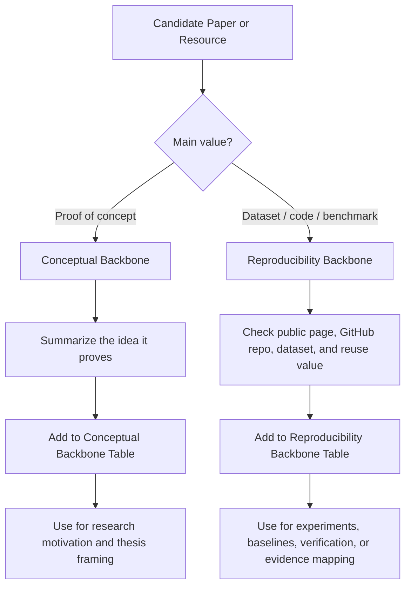

# Backbone Evidence Layer

The **Backbone Evidence Layer** identifies the highest-value papers, datasets, code resources, and benchmark materials supporting the **AI/ML WiFi Sensing Hub**.

This layer separates evidence into two complementary groups:

1. **Conceptual Backbone Papers** — proof-of-concept papers that justify the research problem, threat model, security gap, clinical-safety framing, or defense theory.
2. **Reproducibility Backbone Resources** — datasets, code repositories, benchmark papers, and experimental resources that support verification, reproduction, or claim checking.

This distinction is important because not every important paper needs to provide a public dataset or GitHub repository. Some papers are important because they prove that a security risk, sensing task, or defense direction is scientifically valid. Other resources are important because they provide public data, code, or benchmarks that can be inspected and reused.

---

## Why This Layer Matters

A professional evidence hub should separate two different kinds of value:

| Evidence Type | Main Question | Example Value |
|---|---|---|
| Conceptual / proof-of-concept value | Does this paper justify the research problem or technical direction? | Physical-layer attack, apnea attack/defense, CSI manipulation, certified defense theory |
| Reproducibility value | Can the dataset, code, or benchmark be inspected and reused? | Public dataset, GitHub repository, benchmark library, reproducible baseline |

This structure helps avoid treating all papers equally. The first group explains **why the research problem matters**. The second group supports **how experiments and claims can be checked**.

---

# A. Conceptual Backbone Papers

These papers justify the core research idea: **AI/ML WiFi sensing systems are useful, but CSI measurements are physically attackable, and robustness should be evaluated using safety-relevant metrics and software/certified defenses.**

These papers are included primarily for **proof-of-concept value**, not because they necessarily provide public datasets or GitHub repositories.

## Ranked Conceptual Backbone Table

| Rank | Paper Title | Main Proof-of-Concept Role | Online Paper Link | Short Note |
|---|---|---|---|---|
| 1 | Practical Adversarial Attack on WiFi Sensing Through Unnoticeable Communication Packet Perturbation | Shows that WiFi sensing can be attacked through communication-packet / preamble-related perturbation without breaking normal network security | [ACM DL](https://dl.acm.org/doi/10.1145/3636534.3649367) | [Details](#conceptual-1) |
| 2 | Adversarial Attack and Defense for WiFi-based Apnea Detection System | Shows healthcare-relevant WiFi sensing can be degraded by adversarial attacks and partially defended | [PDF](https://www.eng.auburn.edu/~szm0001/papers/infocom23_poster.pdf) | [Details](#conceptual-2) |
| 3 | Adversarial OFDM Spectrum Modification to Manipulate Channel State Information Systems | Shows OFDM-aware subcarrier-level manipulation of CSI measurements | [DOI](https://doi.org/10.1109/DySPAN64764.2025.11115902) | [Details](#conceptual-3) |
| 4 | Security Analysis of WiFi-based Sensing Systems: Threats from Perturbation Attacks | Shows black-box / universal perturbation threats against WiFi sensing services | [arXiv](https://arxiv.org/abs/2404.15587) | [Details](#conceptual-4) |
| 5 | Certified Adversarial Robustness via Randomized Smoothing | Provides the certified robustness theory that can motivate software-only robustness guarantees | [PMLR](https://proceedings.mlr.press/v97/cohen19c.html) / [GitHub](https://github.com/locuslab/smoothing) | [Details](#conceptual-5) |

---

## Expandable Conceptual Backbone Notes

<strong>1. Practical Adversarial Attack on WiFi Sensing Through Unnoticeable Communication Packet Perturbation</strong>

**Main role:** Physical-layer / packet-level proof of concept for attacking WiFi sensing.

**Why it matters:**  
This paper supports the central research claim that WiFi sensing systems can be attacked by manipulating the physical-layer information used for CSI estimation, without necessarily breaking higher-layer encryption or authentication.

**How it supports this hub:**

- Justifies the CSI measurement-integrity problem.
- Supports the argument that normal WiFi security does not automatically protect sensing outputs.
- Provides a concrete adversarial threat model for WiFi sensing.
- Motivates evaluating WiFi sensing under adversarial conditions, not only clean accuracy.

**Hub use:** Conceptual backbone for the physical-layer attack model.

<strong>2. Adversarial Attack and Defense for WiFi-based Apnea Detection System</strong>

**Main role:** Healthcare-relevant adversarial attack/defense proof of concept.

**Why it matters:**  
This paper is directly aligned with healthcare-relevant WiFi sensing because it studies adversarial attacks and defense for WiFi-based apnea detection.

**How it supports this hub:**

- Shows that WiFi-based physiological monitoring can be vulnerable to adversarial examples.
- Connects adversarial ML to a healthcare-relevant sensing task.
- Provides motivation for translating accuracy degradation into patient-safety consequences.
- Supports the need for defense evaluation, not only attack demonstration.

**Hub use:** Conceptual backbone for healthcare-relevant adversarial WiFi sensing.

<strong>3. Adversarial OFDM Spectrum Modification to Manipulate Channel State Information Systems</strong>

**Main role:** OFDM-level CSI manipulation proof of concept.

**Why it matters:**  
This paper strengthens the electrical-engineering side of the hub by showing that CSI can be manipulated at the subcarrier level using OFDM-aware techniques, rather than only through broad jamming or high-level adversarial examples.

**How it supports this hub:**

- Supports subcarrier-level CSI attack modeling.
- Connects physical-layer signal design to sensing corruption.
- Helps distinguish controlled CSI manipulation from conventional wireless interference.
- Strengthens the argument that sensing security must be evaluated at the physical layer.

**Hub use:** Conceptual backbone for OFDM/CSI manipulation.

<strong>4. Security Analysis of WiFi-based Sensing Systems: Threats from Perturbation Attacks</strong>

**Main role:** Black-box / universal perturbation proof of concept.

**Why it matters:**  
This paper supports the idea that WiFi sensing systems may be vulnerable even when the attacker does not have full white-box access to the target model.

**How it supports this hub:**

- Motivates black-box and transfer-based attack evaluation.
- Supports broader WiFi sensing threat modeling beyond one architecture.
- Shows why robustness should be evaluated across sensing tasks and environments.
- Helps frame perturbation attacks as a general WiFi sensing security risk.

**Hub use:** Conceptual backbone for black-box perturbation threats.

<strong>5. Certified Adversarial Robustness via Randomized Smoothing</strong>

**Main role:** Certified-defense theory.

**Why it matters:**  
This paper provides the theoretical foundation for randomized smoothing, which can motivate software-only robustness guarantees and worst-case robustness bounds.

**How it supports this hub:**

- Provides certified robustness theory.
- Supports moving beyond empirical defense claims.
- Motivates robust evaluation with formal perturbation envelopes.
- Can be adapted conceptually to WiFi CSI time-series models.

**Hub use:** Conceptual backbone for certified robustness and software-only hardening.

---

# B. Reproducibility Backbone Resources

These resources support actual experiments, benchmark design, dataset/code verification, or claim checking.

Unlike the conceptual backbone, this section should prioritize resources with visible public code, datasets, benchmark pages, or GitHub repositories.

## Ranked Reproducibility Backbone Table

| Rank | Paper / Resource Title | Why It Matters for Reproducibility | Public Dataset / Project Page | GitHub / Code Link | Short Note |
|---|---|---|---|---|---|
| 1 | SenseFi: A Library and Benchmark on Deep-Learning-Empowered WiFi Human Sensing | Open-source benchmark/library for WiFi CSI human sensing using deep learning | [Paper / Dataset](https://data.mendeley.com/datasets/dzvgyxkx2f/1) | [GitHub](https://github.com/xyanchen/WiFi-CSI-Sensing-Benchmark) | [Details](#reproducibility-1) |
| 2 | CSI-Bench: A Large-Scale In-the-Wild Dataset for Multi-task WiFi Sensing | Large-scale benchmark dataset for real-world WiFi sensing with multiple tasks | [Project Page](https://ai-iot-sensing.github.io/projects/project.html) / [Kaggle](https://www.kaggle.com/datasets/guozhenjennzhu/csi-bench) | [GitHub](https://github.com/Jenny-Zhu/CSI-Bench-Real-WiFi-Sensing-Benchmark/) | [Details](#reproducibility-2) |
| 3 | WiAR: A Public Dataset for WiFi-Based Activity Recognition | Public WiFi activity-recognition dataset with CSI/RSSI data and example code | [Paper / Info](https://www.researchgate.net/publication/336449005_Wiar_A_Public_Dataset_for_Wifi-Based_Activity_Recognition) | [GitHub](https://github.com/linteresa/WiAR) | [Details](#reproducibility-3) |
| 4 | FallDeFi: Ubiquitous Fall Detection using Commodity Wi-Fi Devices | Fall-detection resource with public GitHub repository and dataset/code links to inspect | [Paper](https://www.davidrojas.co.uk/wp-content/uploads/2017/10/falldefi_ubiquitous_fall_detection_wifi.pdf) | [GitHub](https://github.com/dmsp123/FallDeFi) | [Details](#reproducibility-4) |
| 5 | MM-Fi: Multi-Modal Non-Intrusive 4D Human Dataset for Versatile Wireless Sensing | Public multimodal dataset including WiFi CSI; useful for future WiFi sensing expansion and cross-modal evaluation | [Project Page](https://ntu-aiot-lab.github.io/mm-fi) | [GitHub](https://github.com/ybhbingo/MMFi_dataset) | [Details](#reproducibility-5) |

---

## Expandable Reproducibility Backbone Notes

<strong>1. SenseFi: A Library and Benchmark on Deep-Learning-Empowered WiFi Human Sensing</strong>

**Main role:** Open-source WiFi CSI sensing benchmark/library.

**Why it matters:**  
SenseFi is valuable because it provides a public benchmark and codebase for comparing deep learning models on WiFi CSI sensing tasks. This makes it useful for reproducible baseline experiments.

**How it supports this hub:**

- Provides a GitHub-based benchmark structure.
- Supports model comparison across WiFi sensing tasks.
- Can help evaluate deep learning architectures before applying adversarial testing.
- Useful for building reproducible evidence around AI/ML WiFi sensing.

**Hub use:** Reproducibility backbone for benchmark design and model baselines.

<strong>2. CSI-Bench: A Large-Scale In-the-Wild Dataset for Multi-task WiFi Sensing</strong>

**Main role:** Large-scale real-world WiFi sensing benchmark.

**Why it matters:**  
CSI-Bench is useful because it targets real-world generalization across homes, users, and sensing tasks. This is important for moving beyond small controlled datasets.

**How it supports this hub:**

- Supports benchmark-style WiFi sensing evaluation.
- Includes healthcare-relevant tasks such as fall detection and breathing monitoring.
- Helps evaluate generalization under realistic indoor variability.
- Provides a resource for comparing models under standardized splits or tasks.

**Hub use:** Reproducibility backbone for large-scale benchmark evaluation.

<strong>3. WiAR: A Public Dataset for WiFi-Based Activity Recognition</strong>

**Main role:** Public WiFi activity-recognition dataset.

**Why it matters:**  
WiAR is useful because it provides publicly accessible WiFi sensing data and code examples that can support activity-recognition baselines and early reproducibility checks.

**How it supports this hub:**

- Provides public WiFi sensing data.
- Supports activity recognition experiments.
- Can be useful for baseline model development.
- May support adversarial robustness experiments after preprocessing.

**Hub use:** Reproducibility backbone for activity-recognition dataset access.

<strong>4. FallDeFi: Ubiquitous Fall Detection using Commodity Wi-Fi Devices</strong>

**Main role:** WiFi CSI fall-detection reproducibility candidate.

**Why it matters:**  
FallDeFi is important because fall detection is one of the first healthcare-relevant categories for this hub, and the associated GitHub repository provides a practical path to inspect implementation resources.

**How it supports this hub:**

- Supports fall-detection evidence.
- Uses commodity WiFi devices.
- Provides a public GitHub resource.
- Helps connect healthcare-relevant sensing to reproducible experiments.

**Hub use:** Reproducibility backbone for fall-detection experiments.

<strong>5. MM-Fi: Multi-Modal Non-Intrusive 4D Human Dataset for Versatile Wireless Sensing</strong>

**Main role:** Multimodal wireless sensing dataset including WiFi CSI.

**Why it matters:**  
MM-Fi is valuable because it provides a larger multimodal dataset that includes WiFi CSI and can support broader AI/ML WiFi sensing research beyond the initial healthcare-relevant category.

**How it supports this hub:**

- Includes WiFi CSI as part of a multimodal sensing dataset.
- Supports action recognition and human perception tasks.
- Provides public project and GitHub resources.
- Useful for future expansion into multimodal and cross-modal sensing.

**Hub use:** Reproducibility backbone for future AI/ML WiFi sensing categories.

---

## Review Workflow

---

## Current Status

This folder organizes the first high-value evidence layer for the **AI/ML WiFi Sensing Hub**.

The current version starts with **5 conceptual backbone papers** and **5 reproducibility backbone resources**. The list can later expand to 10 items in each category after links, datasets, code repositories, and claims are reviewed.
